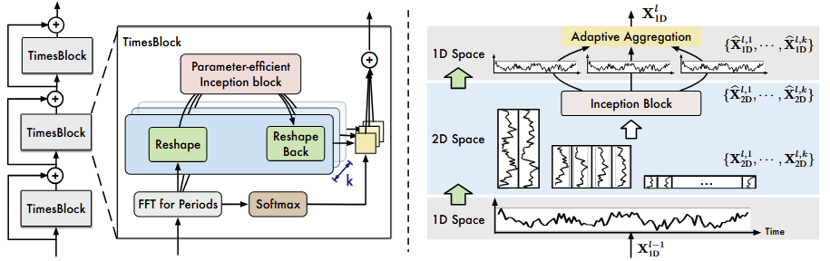
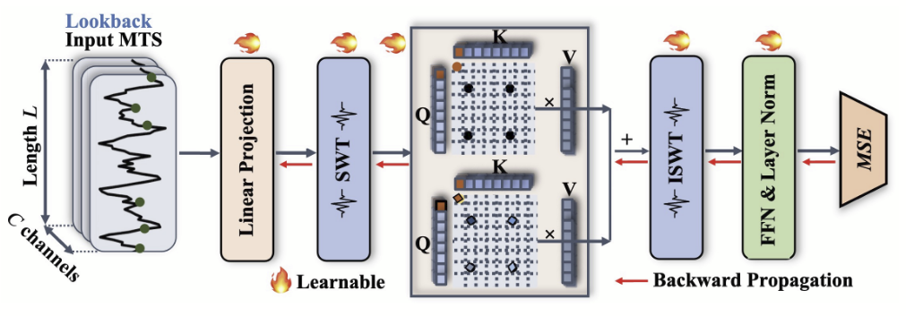
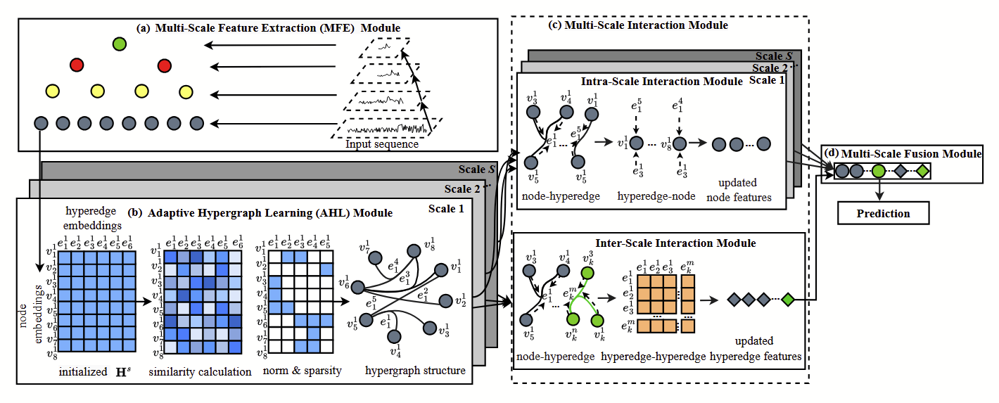
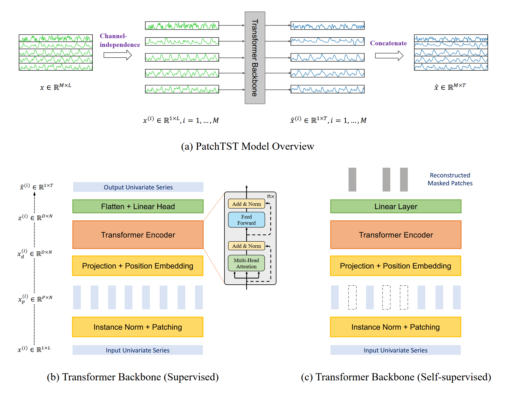
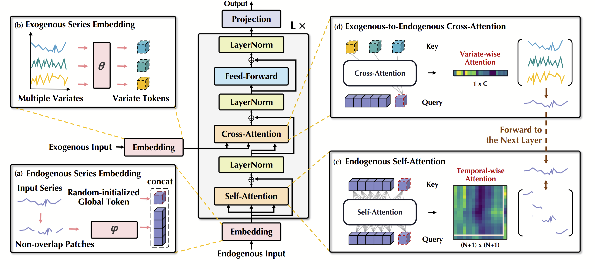
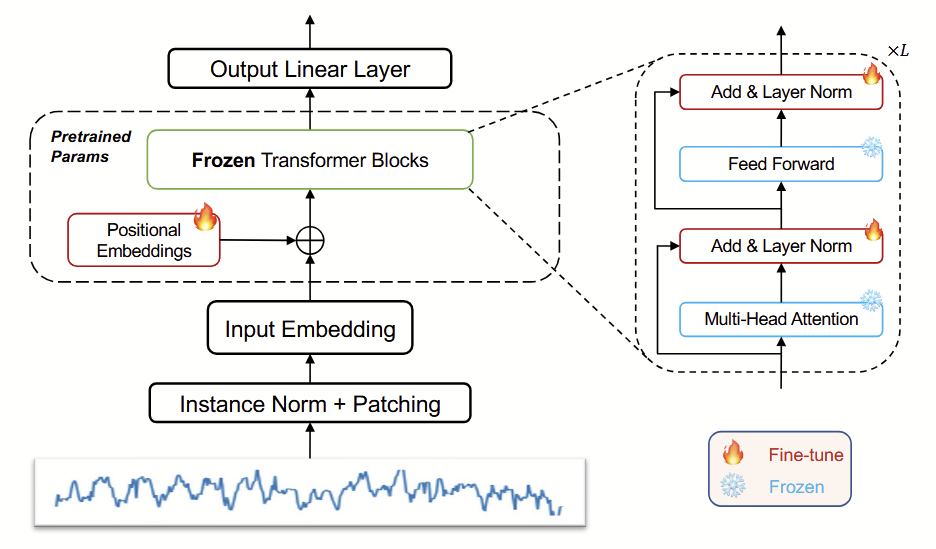
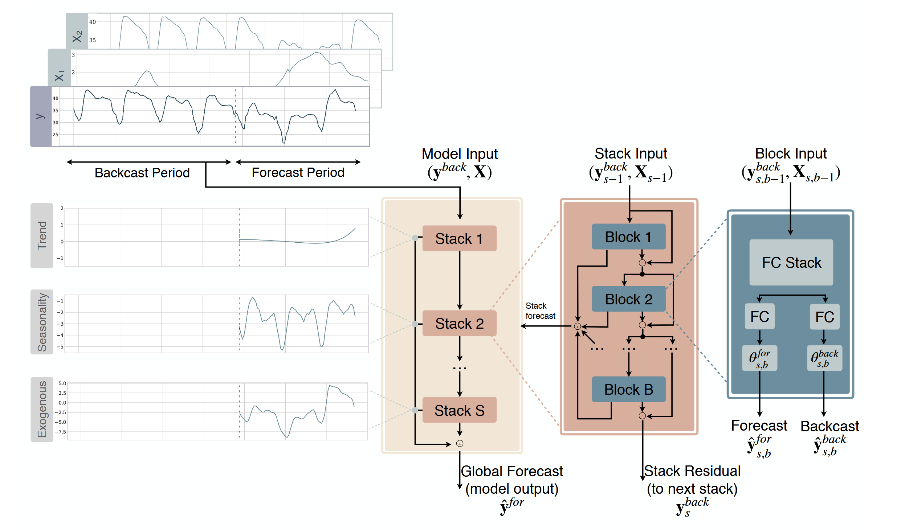

# Non-Stationary Forecasting
Time series forecasting plays a critical role in understanding and predicting dynamic systems
across various domains, including finance, healthcare, and environmental monitoring. However,
accurately forecasting non-stationary signals—data characterized by changing statistical properties
such as mean, variance, or seasonality over time—remains a significant challenge. Non-stationary
signals often arise from complex, real-world events like abrupt market shifts, extreme weather
patterns, or evolving biological processes.

This project aims to investigate the effectiveness of current machine learning-based forecasting
models in predicting non-stationary events. By evaluating the performance of established methods
such as GPT-based approaches on real-world non-stationary datasets, this study seeks to identify
their strengths, limitations, and applicability. The findings will help determine whether these
models can reliably capture the patterns and abrupt transitions inherent to non-stationary signals,
or if advancements are needed to improve their predictive accuracy in such scenarios 

Current research heavily focusses on public datasets. For long-term forecasting the datasets ETT, Electricity, Weather, Exchange and ILI are frequently used for evaluating novel machine learning models. For short-term forecasting, many authors use the M4 dataset. You can download these datasets from this google drive [Datasets](https://drive.google.com/drive/folders/13Cg1KYOlzM5C7K8gK8NfC-F3EYxkM3D2) provided by the authors from the TimesNet paper.


## Datasets


| Dataset     | Signal Type              | Variates                  | Activity Type                     | Frequency | 
|-------------|--------------------------|---------------------------|-----------------------------------| -------- |
| [WildPPG](https://arxiv.org/abs/2412.17540)    | PPG / HR                    | 1          | Accelerometer                  |25 Hz |
| [DaLiA](https://archive.ics.uci.edu/dataset/495/ppg+dalia)      | PPG / HR | 1            | Accelerometer   | 32 Hz|
| [IEEE SPC](https://ieeexplore.ieee.org/document/6905737)         | PPG / HR           | 1            | Accelerometer  | 25 Hz|


<details>
  <summary>WildPPG</summary>

  ### WildPPG
</details>
<details>
  <summary>DaLia</summary>

  ### WildPPG
</details>
<details>
  <summary>IEEE SPC</summary>

  ### WildPPG
</details>


## Complex Deep Learning Models 

| Model        | Description | Supports Short Seq | Link |
|--------------|-------------|---------| ----- |
| [TimesNet](https://arxiv.org/abs/2210.02186)     | Transformer-based model tailored for long-term time series forecasting. Excels in multivariate settings.| No | [GitHub](https://github.com/thuml/Time-Series-Library/) |
| [SimpleTM](https://openreview.net/forum?id=oANkBaVci5)    | Lightweight and simple transformer with minimal changes, offering strong performance on time series tasks. | Yes| [GitHub](https://github.com/vsingh-group/SimpleTM/) |
| [Ada-MSHyper](https://arxiv.org/abs/2410.23992)  | Adaptive multi-scale hypernetwork that dynamically generates model weights based on input resolution. | No | [GitHub](https://github.com/shangzongjiang/Ada-MSHyper) |
| [PatchTST](https://arxiv.org/abs/2211.14730) | Unified GPT-based model that performs multiple time series tasks without retraining ("one fits all"). | Yes | [GitHub](https://github.com/DAMO-DI-ML/)
| [TimeXer](https://arxiv.org/abs/2402.19072)| Unified GPT-based model that performs multiple time series tasks without retraining ("one fits all"). | Yes | [GitHub](https://github.com/DAMO-DI-ML/)
| [GPT4TS](https://arxiv.org/abs/2302.11939)| Unified GPT-based model that performs multiple time series tasks without retraining ("one fits all"). | Yes | [GitHub](https://github.com/DAMO-DI-ML/)
| [NBeatsX](https://arxiv.org/abs/2104.05522)| Unified GPT-based model that performs multiple time series tasks without retraining ("one fits all"). | Yes | [GitHub](https://github.com/DAMO-DI-ML/)

<details>
  <summary>TimesNet</summary>

  ### TimesNet
  <p align="center">
    
  </p>

</details>

<details>
  <summary>SimpleTM</summary>

  ### SimpleTM
  
  <p align="center">
    
  </p>

</details>

<details>
  <summary>AdaMSHyper</summary>

  ### AdaMSHyper

  <p align="center">
    
  </p>

</details>
<details>
  <summary>PatchTST</summary>

  ### PatchTST

  <p align="center">
    
  </p>

</details>
<details>
  <summary>TimeXer</summary>

  ### TimeXer

  <p align="center">
    
  </p>


</details>
<details>
  <summary>GPT4TS</summary>

  ### GPT4TS

  <p align="center">
    
  </p>


</details>
<details>
  <summary>NBeatsX</summary>

  ### NBeatsX

  <p align="center">
    
  </p>


</details>


## Baselines
### Overview
- [Linear Models](https://scikit-learn.org/stable/modules/linear_model.html)
- [Markov Switching Autoregressive (MSAR)](https://www.statsmodels.org/dev/examples/notebooks/generated/markov_autoregression.html#Hamilton-(1989)-switching-model-of-GNP)
- [Kalman Filters](https://www.quantstart.com/articles/State-Space-Models-and-the-Kalman-Filter/)
- [Gaussian Processes](https://gpytorch.ai/)
- [Bayesian Neural Networks](https://docs.pyro.ai/en/dev/contrib.bnn.html)
- [XGBoost](https://xgboost.readthedocs.io/en/stable/)

<details>
  <summary>Linear Models</summary>

  ### Linear Regression 
The simplest model one can think of is a linear model. We define the design matrix $X \in \mathbb{R}^{N \times L}$, where $N \in \mathbb{N}$ is the number of extracted windows from the time series and $L \in \mathbb{N}$ is the lookback window length. Let $Y \in \mathbb{R}^{N \times T}$ be the target or ground truth prediction windows. The assumed linear model is then written down as 
$$X \Beta^* + \boldsymbol{W} = Y$$
where $\boldsymbol{W}_{i,j} \sim \mathcal{N}(0, \sigma^{2})$ is a random matrix with i.i.d standard gaussian noise. 

The  maximum likelihood estimator of $\Beta^*$ is 
$$\hat{\Beta} = (X^{\top}X)^{-1}X^{\top}Y$$

In this work, we use plain old linear regression, but there are more powerful approaches such as 
- Ridge Regression 
- LASSO 
- Elastic Net 

</details>

<details>
  <summary>Markov Switching Autoregressive Models</summary>

  ### Markov Switching Autoregressive Models 

</details>

<details>
  <summary>Kalman Filter</summary>

  ### Markov Switching Autoregressive Models 

</details>

<details>
  <summary>Gaussian Processes</summary>

  ### Markov Switching Autoregressive Models 

</details>

<details>
  <summary>Extreme Gradient Boosting Trees</summary>

  ### Markov Switching Autoregressive Models 

</details>

<details>
  <summary>Multi-layered Perceptron</summary>

  ### Markov Switching Autoregressive Models 

</details>


## Installation 
This project uses [miniconda](https://www.anaconda.com/docs/getting-started/miniconda/install#quickstart-install-instructions) for dependencies management. Use the following commands in your favourit shell. 

```
git clone https://github.com/eth-siplab-students/t-mt-2025-NonstationaryForecasting-ClemensKeusch.git

cd t-mt-2025-NonstationaryForecasting-ClemensKeusch
conda env create -f environment.yaml
conda activate thesis 
```

## Codebase

```text
.
├── assets                    # assets for the README file 
├── configs                   # directory in which all experiment '.yaml' configs are stored
├── scripts                   # bash scripts to launch training and evaluation
│   ├── train.sh              #   training script
│   └── eval.sh               #   evaluation script
├── src                       # the package
│   ├── plotting.py           #   plotting function to training tracking
│   ├── utils.py              #   helper functions for init of models & opt/loading checkpoint
│   ├── dataset               #   datasets, data loaders, ...
│   └── model                 #   models, training loops, ...
├── tools                     # scripts to compute PCA prior to training
├── main.py                   # entrypoint for launch PMAE pretraining locally on your machine
└── requirements.txt          # requirements file
```


## Running Experiments 
This project uses [Hydra](https://hydra.cc/) and  [WandB](https://wandb.ai/)  for experiment tracking. In the following, I explain how to run the code locally or on a SLURM cluster (all models in this project were trained on the [Euler cluster](https://scicomp.ethz.ch/wiki/Euler)). Make sure to always activate the conda environment. 
``` 
conda activate thesis
```
Since we use the hydra library, you can configure all parameters for the dataset or model either with the command line or directly in the config file. The most important config file is `` config/config.yaml``. 
The first part of the ``config.yaml`` file contains 
```
defaults:
  - _self_
  - model: elastst
  - dataset: dalia
  - path: local
```
Here you can specify what model you want to train and which dataset should be used. The name of the model and dataset has to be the same as the corresponding yaml file in the ``config/model/`` and ``config/dataset/`` directory. 

As already hinted at above, you can also directly change the config parameters in the command line. For this use the following syntax.
```
python main.py model=simpletm dataset=wildppg seed=17
```
Even if the config file would contain the dalia dataset, the command above would override this information with the wildppg dataset. 

### Local 
For training and testing a model locally, you can use 
```
python main.py 
```

### SLURM cluster
For training models on the SLURM cluster, we use the [Submitit Launcher plugin](https://hydra.cc/docs/plugins/submitit_launcher/) for hydra. This plugin allows specifying the SLURM related parameters again in a config file and hence neatly integrates into the hydra framework. Hydra also allows sweeping over different parameter configurations. This makes running ablations studies efficient. Make sure to always use the flag ``--multirun``, even if you only run a single experiment. 

As an example consider the following command.

```
python main.py --multirun hydra/launcher=submitit_slurm look_back_window=3,4,5 prediction_window=1,2,3
```
This command sweeps over all lookback window and prediction window combinations (in this case 9 combinations) and spawns a job for each of them. 


### Hydra Optuna Sweeper 
On the 30th of April, I installed the hydra optuna sweeper plugin using 
```
pip install hydra-optuna-sweeper --upgrade
```
(see https://hydra.cc/docs/plugins/optuna_sweeper/).

This plugin does not natively support WandB. Thus, I added the `optuna.integration.WeightsAndBiasesCallback` to the `_imp.py` file and added three parameters to the sweeper, namely `use_wandb, metric_name, wandb_kwargs`. 
For now, I just copy the changes I made locally to the cluster, but later I may have to create a package to install it properly. 


## Resources

### Books

- [Forecasting: Principles and Practice](https://otexts.com/fpp3/) 
- [Time Series Analysis and Its Applications](http://www.stat.ucla.edu/~frederic/415/S23/tsa4.pdf)

### Papers

- [Forecasting: theory and practice](https://forecasting-encyclopedia.com/)
- [A Comprehensive Survey of Deep Learning for Time Series Forecasting](https://arxiv.org/abs/2411.05793)